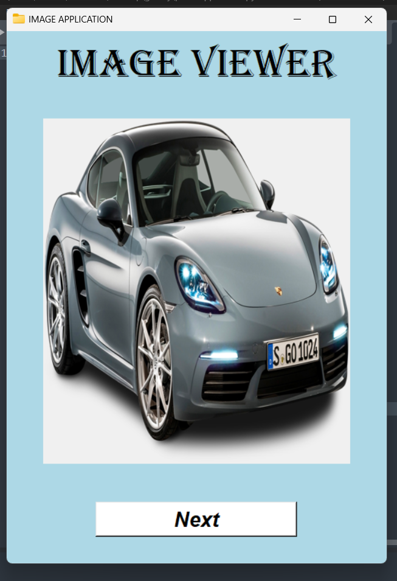

# 🖼️ Image Viewer Application

A simple desktop GUI application built using **Python**, **Tkinter**, and **Pillow**. It loads all images from a specified folder and lets you cycle through them one-by-one using a "Next" button.

---

## 📌 Features

* Loads images dynamically from a local folder
* Resizes images uniformly (400x450) before displaying
* Displays one image at a time
* "Next" button cycles through all images
* Built with Tkinter GUI and PIL for image processing

---

## 🧾 Prerequisites

Python 3.x should be installed.

Dependencies:

* [`Pillow`](https://pypi.org/project/Pillow/)

Install dependencies with:

```bash
pip install -r requirements.txt
```

Contents of `requirements.txt`:

```
Pillow
```

---

## 🗂️ Folder Structure

```
gallery/
├── photoapplication.py       # Main application file
├── requirements.txt          # Dependencies list
├── run.bat                   # Windows batch file to launch app
├── steps_to_run.txt          # Manual setup/run instructions
├── screenshot.png            # UI screenshot for reference
├── .gitignore                # Git ignore rules
└── venv/                     # (optional) Virtual environment
```

---

## 🖼️ Screenshot of the App



---

## 📂 Image Folder Setup


```
 edit the line in `photoapplication.py`:

```python
files = os.listdir('images folder address')
```

Ensure your folder contains `.jpg`, `.jpeg`, `.png`, or similar image files.

---

## 🚀 How to Run

### Option 1: Manually Using Python

1. Open terminal and navigate to the folder:

   ```bash
   cd path\to\gallery
   ```

2. (Optional) Create and activate virtual environment:

   ```bash
   python -m venv venv
   venv\Scripts\activate   # For Windows
   ```

3. Install dependencies:

   ```bash
   pip install -r requirements.txt
   ```

4. Run the application:

   ```bash
   python photoapplication.py
   ```

---

### Option 2: Run Using Batch File (Windows)

Double-click `run.bat` (make sure Python and the virtual environment are set up).

**Contents of `run.bat`:**

```bat
@echo off
cd /d %~dp0
venv\Scripts\activate
python photoapplication.py
pause
```

---

## 📜 `steps_to_run.txt` Contents

```
1. Ensure Python is installed.
2. Open terminal and go to the folder.
3. Create virtual environment: python -m venv venv
4. Activate it: venv\Scripts\activate
5. Install dependencies: pip install -r requirements.txt
6. Ensure image folder exists and contains images.
7. Run the app: python photoapplication.py
```

---

## 🙋 Author

**Mohit**
Simple Tkinter-based photo viewer project.

---

📆 Now you're ready to run the app!
